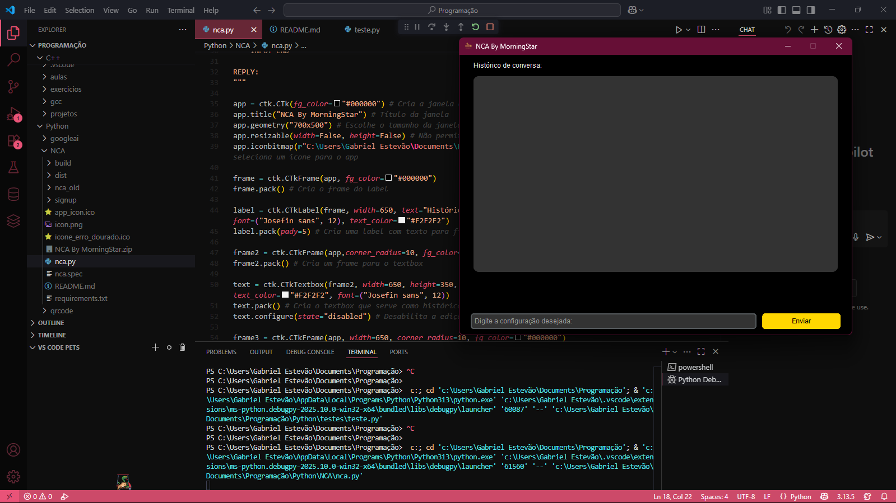

# ⚡ NCA by MorningStar  
**Network Configuration Assistant powered by Google Gemini & PyQt5**  

  
  
  
  
  

---

## 🚀 Sobre o Projeto  
O **NCA by MorningStar** é um assistente inteligente para **automação de redes**, capaz de gerar **comandos CLI** e **scripts prontos** para configuração de **roteadores, switches, firewalls, Mikrotik e servidores (Linux/Windows)**.  
Tudo isso através de uma interface gráfica simples e intuitiva, usando **CustomTkinter**.  

---

## 🧠 Como funciona?  
- O usuário descreve a configuração desejada (ex.: *"Configurar VLAN 10 no Mikrotik"*)  
- O app envia o prompt para a API do **Google Gemini**  
- A IA responde com:  
  ✅ **Script CLI pronto para uso**  
  ✅ **Explicações detalhadas (se solicitado)**  

---

## ✨ Features  
✅ Interface gráfica responsiva (**CustomTkinter**)  
✅ Integração com **Google Gemini**  
✅ Histórico de conversas integrado  
✅ Geração de **comandos CLI prontos**  
✅ Fácil adaptação para diferentes fabricantes  

---

## 📸 Screenshot  
  

---

## 🛠 Tecnologias Utilizadas  
- **Python 3.9+**  
- [customtkinter](https://pypi.org/project/customtkinter/)  
- [CTkMessagebox](https://pypi.org/project/ctkmessagebox/)  
- [darkdetect](https://pypi.org/project/darkdetect/)  
- [google-generativeai](https://pypi.org/project/google-generativeai/)  

---

## ⚙️ Instalação  
```bash
# Clone o repositório
git clone https://github.com/gaaBa0/Network-Configuration-Assistant

# Acesse a pasta do projeto
cd Network-Configuration-Assistant

# Crie um ambiente virtual
python -m venv venv
source venv/bin/activate  # Linux/Mac
venv\Scripts\activate     # Windows

# Instale as dependências
pip install -r requirements.txt
```

**requirements.txt**
```
customtkinter
google-generativeai
CTKMessagebox
darkdetect
time
```

---

## ▶️ Como Executar  
```bash
python main.py
```

---

## 🔑 Configuração da API Key  
Antes de rodar o app, configure sua chave da API do **Google Generative AI**:  
```python
genai.configure(api_key="SUA_CHAVE_AQUI")
```

> **Obs.:** Para obter a chave, acesse [Google AI Studio](https://ai.google.dev/).

---

## ✅ Exemplo de Uso  
> **Entrada:**  
```
Configurar NAT em um roteador Mikrotik para saída à internet
```

> **Saída (IA):**  
```
/ip firewall nat
add chain=srcnat action=masquerade out-interface=ether1

Explicação:
- chain=srcnat → Define a regra para NAT de origem
- action=masquerade → Oculta IPs internos usando IP público
- out-interface=ether1 → Define a interface de saída
```

---

## 📌 Roadmap  
- [ ] Adicionar suporte a múltiplos modelos IA
- [x] Adicionar histórico de conversas
- [ ] Exportar scripts para arquivo  
- [x] Dark Mode  
- [ ] Modo CLI sem interface gráfica
- [x] Nova interface gráfica

---

## 🤝 Contribuição  
Sinta-se à vontade para **abrir issues** ou **enviar pull requests**.  

---

## 📜 Licença  
Este projeto está sob a licença **MIT**.  
